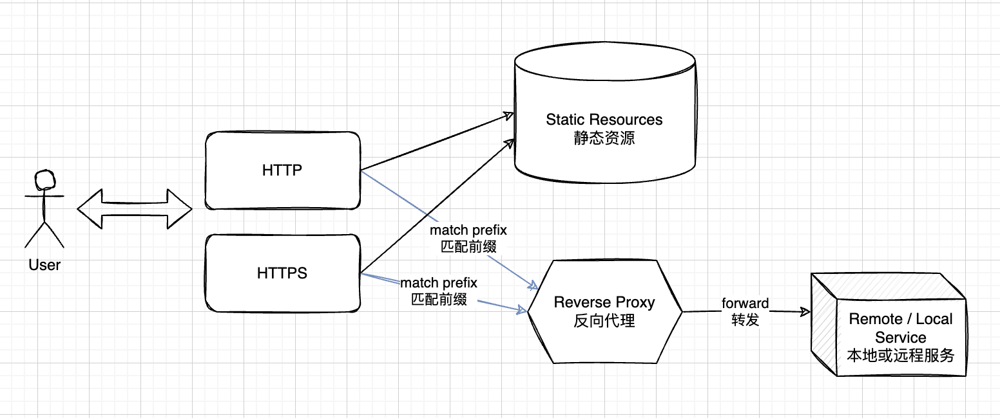

# koa-static-with-reverse-proxy

本项目使用 Koa 与 TypeScript 搭建了开箱即用的集成静态文件服务与反向代理服务的应用，随项目包含了 HTTPS 的 demo 证书。特别适合于开发/部署中途快速测试。



# 使用

## 安装依赖

`pnpm` 是我的心头好，所以用到包管理器的地方都用了它，不过 `npm` 和 `yarn` 应当也都可以用。

```shell
$ pnpm install
```

## 配置

检查根目录下的 `config.sample.yml` 和它的注释，根据你的需要更改其中的配置，然后复制粘贴为 `config.yml` 即可。

根目录下已经放置了一个 `config.yml` 以便开箱即用。

## 运行

```shell
$ node src/run.ts
```
## 风格检查

ESLint 的配置文件在 `/.eslintrc.yml`，配置了 Airbnb 规则与 Node 运行环境。使用下面脚本以便直接开始运行。

```shell
$ pnpm lint
```

# 其他

## SSL 证书

项目根路径下包含了 `server.*` 的两个文件分别为证书与签名文件。它们不是证书管理机构签发的正式文件，仅仅是测试用的临时文件。所以如果你用了它们，应该会提示证书错误——不过当你看到证书错误时，说明你的 HTTPS 服务已经在工作了。不要在生产环境中用它们。
