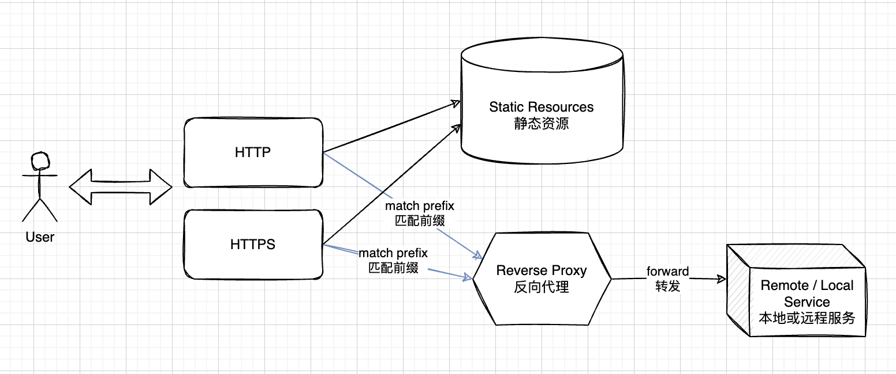

# koa-static-with-reverse-proxy

[中文文档](./README-zh.md)

This project provides a ready-to-go static server, reverse proxy server and SSL demo certificates using Koa and TypeScript.

A small gadget to help speed up testing and infrastructuring during DevOps.



# Usage

## Install Dependencies

I personally prefer `pnpm` thus the scripts are all written for using it. However, the same should go with `npm` and `yarn`.

```shell
$ pnpm install
```

## Configure

Check `config.sample.yml` and make any change you prefer. Copy-paste it as `config.yml` such that the program could read for it.

There is one `config.yml` under the folder for out-of-the-box usage.

## Run

```shell
$ node src/run.ts
```
## Style Check / Linting

ESLint is configured with Airbnb rule and Node environment. The configuration file is at `/.eslintrc.yml`.

```shell
$ pnpm lint
```
# Misc

## SSL Certificate

A certificate and corresponding signing key is included in this project. However, these files are not signed by any trusted certificate organization. Your browser should complain about their invalidity -  when you see the complaint, ignoring it is fine, but DO NOT use them in production.
